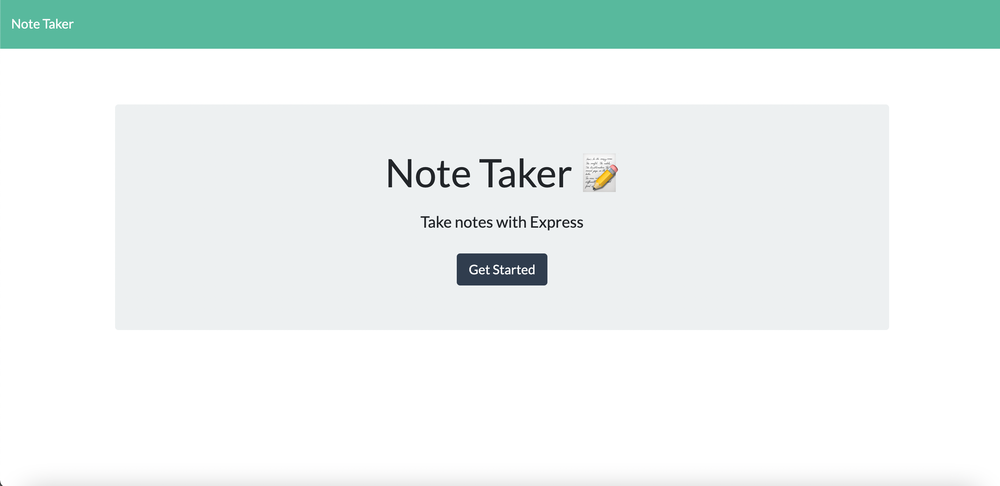

# Note-Taker  

## Description
   This application allows user to create note to keep track of tasks and saves it in the left-hand column. User can click on saved note's title on the left and the notes will display on the right-hand. Users can delete note once they have completed their task but clicking on the trash bin next to it
   
## Table of Contents

  - [Installation](#Installation)
  - [Usage](#Usage)
  - [Questions](#Questions)

## Installation
  run npm install express from command line to install express module

## Usage

To start application, in the main directory run npm start in the terminal 
Use http://localhost:3001 once application is started in the application 
You can click [HERE](https://muktarnotetakerapp.herokuapp.com/) to access it without running in the terminal 

## Questions
If you have any Questions, reach me at [Github](https://github.com/mukey6)
    
 
